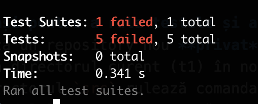

# Tema 2

## JavaScript

### Obiectiv: să se modifice în locul marcat fișierul [app.js](./src/app.js) astfel încât să treacă [testele](./src/test/)

### 1. Știind că:
- funcția `render(input, values)` primește ca parametri:
    - un obiect `input`
    - un obiect `values`

- folosind valorile primite, aceasta trebuie să genereze un string cu tag-uri, similar cu marcajele HTML, în care să înlocuiască marcatorii din input cu valorile din values
    - o valoare va fi marcată în input printr-un marker de tipul `${key}`, marker ce va fi înlocuit cu valoarea cheii din `values`

- exemplu:
    - la apelul metodei cu parametrii render({ a: 'some ${value1}'}, { value1: 'thing'}), metoda trebuie să returneze valoarea ````<a>some thing</a>````
    - la apelul metodei cu parametrii de mai jos, trebuie să returneze valoarea: ````<a><b><c>content</c></b><d>first</d></a><c><e>second</e></c>````
        ```js
        render(
            {
                a: {
                    b: {
                        c: 'content'
                    },
                    d: '${v1}'
                },
                c: {
                    e: '${v2}'
                }
            }, 
            {
                v1: 'first',
                v2: 'second'
            }
        );
        ```

### 2. Completați următoarele cerințe:
- funcția returnează un string vid dacă primul parametru este un obiect vid (0.5 pts)
- funcția aruncă o excepție cu mesajul `InvalidType` dacă unul dintre parametrii primiți nu este un obiect (0.5 pts)
- funcția returnează rezultatul corect pentru un caz simplu (0.5 pts)
- funcția face substituție de token-uri (0.5 pts)
- funcția returnează rezutatul curect pentru un caz complex (0.5 pts)

### 3. Pași pentru a rula testele și a trimite tema:
1. Creează un repository nou, **privat** pe GitHub cu numele *webtech-tema-2*
2. Adaugă directorul curent (homework2) în noul repository
3. În directorul `src` rulează comanda `npm install` pentru a instala modulele necesare executării testelor
4. Adaugă implementarea necesară rezolvării cerințelor în fișierul app.js din directorul src
5. În directorul `src` rulează comanda `npm test` pentru a rula testele
6. Verifică rezultatul testelor
    - Teste picate

        

    - Teste valide

        

7. După rezolvarea cerințelor creează un commit și folosește comanda push pentru a încărca modificările pe GitHub (detalii în [primul seminar](./../lab1/README.md))
8. Acordă acces profesorului de la seminar pentru verificarea repository-ului
    - [Tutorial acordare acces](https://docs.github.com/en/account-and-profile/setting-up-and-managing-your-personal-account-on-github/managing-access-to-your-personal-repositories/inviting-collaborators-to-a-personal-repository)
    - User profesor: [ioanaandreeab](https://github.com/ioanaandreeab)
9. Copiază link-ul repository-ului și completează [acest formular](https://forms.gle/5cEYPavMPmwU7LFeA)