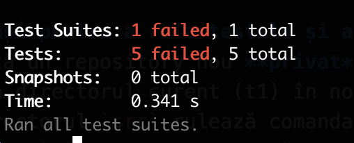
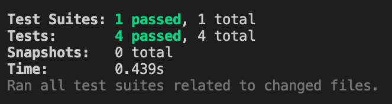

# Tema 3

## REST

### Obiectiv: să se modifice aplicația inițială astfel încât să treacă [testele](./src/test/)

### 1. Completați următoarele cerințe:
- Dată fiind aplicația `app` completați metoda `POST` la adresa `/food-items`:

    - Dacă s-a trimis un request cu un corp gol sau nedefinit, se va returna un json cu următorul format: `{"message": "body is missing"}`. Codul de răspuns va fi: `400`; (0.5 pts)
    - Dacă din corpul request-ului lipsesc proprietăți se va returna un json cu următorul format: `{"message": "malformed request"}`. Codul de răspuns va fi: `400`; (0.5 pts)
    - Numărul de calorii trebuie să fie un număr pozitiv; în caz contrar se va returna un json cu următorul format: `{"message": "calories should be a positive number"}`. Codul de răspuns va fi: `400`; (0.5 pts)
    - Dacă elementul trimis prin corpul request-ului este valid, va fi adăugat și se va returna un răspuns cu  codul `201`. Corpul răspunsului va fi `{"message": "created"}`;(0.5 pts)
    - Dacă elementul adăugat are o categorie invalid, se va returna un json cu următorul format: `{"message": "not a valid category"}`. Codul de răspuns va fi: `400`. (0.5 pts)

### 2. Pași pentru a rula testele și a trimite tema:
1. Creează un repository nou, **privat** pe GitHub cu numele *webtech-tema-3*
2. Adaugă directorul curent (homework3) în noul repository
3. În directorul `src` rulează comanda `npm install` pentru a instala modulele necesare executării testelor
4. Adaugă implementarea necesară rezolvării cerințelor în fișierul app.js din directorul src
5. În directorul `src` rulează comanda `npm test` pentru a rula testele
6. Verifică rezultatul testelor
    - Teste picate

        

    - Teste valide

        

7. După rezolvarea cerințelor creează un commit și folosește comanda push pentru a încărca modificările pe GitHub (detalii în [primul seminar](./../lab1/README.md))
8. Acordă acces profesorului de la seminar pentru verificarea repository-ului
    - [Tutorial acordare acces](https://docs.github.com/en/account-and-profile/setting-up-and-managing-your-personal-account-on-github/managing-access-to-your-personal-repositories/inviting-collaborators-to-a-personal-repository)
    - User profesor: [ioanaandreeab](https://github.com/ioanaandreeab)
9. Copiază link-ul repository-ului și completează [acest formular](https://forms.gle/AXRHv9gJEVCBWynM9)