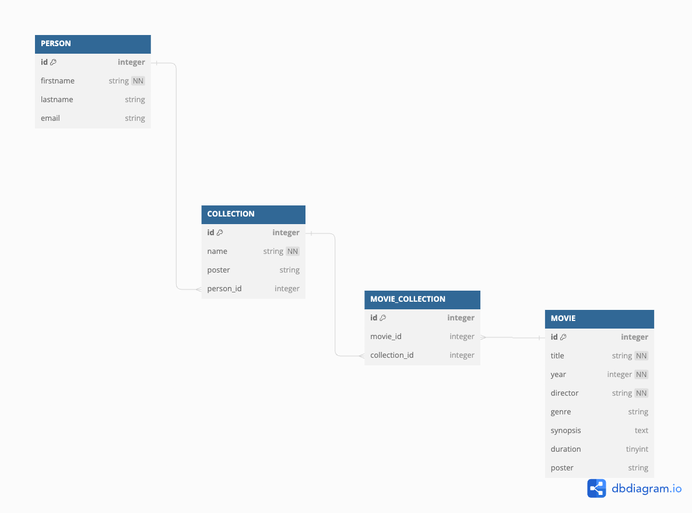

# Seminar 8 - Recapitulare back-end & relațiile dintre entități

### Conținut

1. [Recapitulare back-end](#1-recapitulare-back-end)
2. [Lucru individual](#2-lucru-individual)
3. [Relațiile dintre entități](#3-rela%C8%9Biile-%C3%AEntre-entit%C4%83%C8%9Bi)

    3.1 [One-to-One](#31-one-to-one)

    3.2 [One-to-Many/Many-to-One](#32-one-to-manymany-to-one)

    3.3 [Many-to-Many](#33-many-to-many)
4. [Relația dintre entitățile Movie și Collection](#4-rela%C8%9Bia-dintre-entit%C4%83%C8%9Bile-movie-%C8%99i-collection)

    4.1 [Structura bazei de date](#41-structura-bazei-de-date)

    4.2 [Implementarea relației](#42-implementarea-rela%C8%9Biei)

5. [Lucru individual 2](#5-lucru-individual-2)

## 1. Recapitulare back-end

- Scopul unei aplicații _server_ (back-end) este de a accepta request-uri din partea _clienților_ și de a răspunde cu date, în funcție de caracteristicile request-ului realizat (_rută, metodă, parametri_)

- Cel mai popular stil arhitectural de a scrie o aplicație back-end este [REST](https://github.com/ioanaandreeab/webtech_labs_2024/tree/main/lab7#1-rest), care definește o serie de recomandări ce trebuie implementate pentru a obține un serviciu _RESTful_

- Pentru a implementa o aplicație server (back-end) în Node.js folosind Express trebuie să respectăm structura proiectului recomandată în [seminarul 6](https://github.com/ioanaandreeab/webtech_labs_2024/tree/main/lab6#63-organizarea-proiectului-curent-%C8%99i-express-router) și să definim următoarele componente, începând, de data aceasta dinspre baza de date înspre interfața expusă:
    1. [fișierul model](../app/models/movies.js)
        - în practică vom avea mai multe fișiere model, fiecare definind un șablon pentru tabelele de la nivelul bazei de date

    2. [fișierul de configurare a bazei de date](../app/models/config.js)
        - la nivelul fișierului de configurare vom stabili detaliile conexiunii cu baza de date

    3. [fișierul controller](../app/controllers/movies.js)
        - implementează logica de business a aplicației, utilizând entitățile definite anterior pentru a citi și a scrie la nivelul bazei de date

    4. [fișierul route](../app/routes/movies.js)
        - definește toate rutele expuse de aplicație pentru o anumită entitate și le conectează cu metodele specifice din controller

    5. [fișierul de agregare al rutelor](../app/routes/index.js)
        - la nivelul fișierului de configurare a rutelor vom agrega toate fișierele individuale ce conțin rute specifice anumitor entități

    7. [fișierul main](../app/main.js)
        - responsabil pentru definirea tuturor configurărilor aplicate la nivelul întregii aplicații
        - importă fișierul de agregare al rutelor și îl montează pe o rută principală
        - instanțiază serverul web și îl pornește, asigurându-se, totodată, că toate celelalte componente necesare sunt disponibile (ex: baza de date)

- Pe lângă aceste componente necesare, ce ne vor ajuta să stocăm informații la nivelul unei baze de date și să răspundem request-urilor venite de la client cu aceste informații, putem defini și _componente opționale_, ce au ca scop adăugarea unor funcționalități _suplimentare_ (precum un fișier de tipul middleware pentru gestionarea erorilor, de exemplu)

## 2. Lucru individual

- Așa cum am amintit în seminarul anterior, aplicația pe care o vom dezvolta împreună, ne va permite să gestionăm mai multe liste de filme pe care dorim să le vizionăm împreună cu alți prieteni

- Pe lângă entitatea **Movie**, pe care deja am implementat-o, este nevoie să implementăm două entități suplimentare:
    - Collection
    - Person

- În continuare vom adăuga entitatea **Collection** și toate componentele necesare pentru implementarea unor endpoint-uri _RESTful_ plecând de la această entitate

- Pași de urmat:
    - **descarcă** forma curentă a aplicației
    - în directorul _app_ **instalează modulele necesare**, specificate în fișierul _package.json_
        - fișierul package.json conține deja toate dependențele necesare, e nevoie să rulezi o singură comandă :)
    - **definește entitatea** după structura:
        - id: integer, cheie primară, autoincrementat
        - name: string, nenul
        - poster: string
    - definește un **controller** specific care va implementa operațiile CRUD asupra entității
        - Create
        - Read
        - Update
        - Delete
    - definește un **fișier de rutare** care va atribui endpointuri pentru fiecare din metodele definite în controllerul entității
    - **importă fișierul de rutare** în fișierul de agregare a rutelor
    - **testarea aplicației** folosind *Postman*

- Pentru a putea parcurge fiecare etapă din dezvoltarea unei aplicații back-end în timpul seminarului, recomandarea este să implementezi, pe rând, fiecare endpoint, în ordinea:
    - create
    - read
        - listare
        - detaliile unei colecții
    - update
    - delete

## 3. Relațiile între entități

- Până acum am utilizat *Sequelize*, cel mai popular ORM scris în Node.js, pentru maparea unui obiect cu o tabelă la nivelul unei bazei de date SQLite

- Pe lângă tabelele propriu-zise, o parte foarte importantă în cadrul bazelor de date relaționale este **definirea relațiilor** dintre două tabele

- Conform SQL, relațiile dintre tabele pot fi de tipul:
    - One-to-One
    - One-to-Many / Many-to-One
    - Many-to-Many

Pentru fiecare relație, Sequelize expune o serie de metode ce pot fi folosite

💡 Fiecare tip de relație între două entități are particularitățile sale, motiv pentru care parcurgerea [documentației Sequelize](https://sequelize.org/docs/v6/core-concepts/assocs/) este necesară pentru înțelegerea tuturor opțiunilor disponibile

### 3.1 One-to-One

- [documentație](https://sequelize.org/docs/v6/core-concepts/assocs/#one-to-one-relationships)
```js
// consideram entitatile User si BankAccount
// un user poate avea un singur cont
// un cont poate fi detinut de catre un singur user
User.hasOne(BankAccount);
BankAccount.belongsTo(User);

// cheia userId va fi definita automat la nivelul tabelei BankAccount
// vor fi generate automat metodele getBankAccount() (pe entitatile de tip user) si getUser() (pe entitatile de tip bank account)
```

### 3.2 One-to-Many/Many-to-One
- [documentație](https://sequelize.org/docs/v6/core-concepts/assocs/#one-to-many-relationships)
```js
// consideram entitatile User si BankAccount
// un user poate avea mai multe conturi
// un cont poate fi detinut de catre un singur user
User.hasMany(BankAccount);
BankAccount.belongsTo(User);

// cheia userId va fi definita automat la nivelul tabelei BankAccount
// vor fi generate automat metodele getBankAccounts() (pe entitatile de tip user) si getUser() (pe entitatile de tip bank account)
```

### 3.3 Many-to-Many
- [documentație](https://sequelize.org/docs/v6/core-concepts/assocs/#many-to-many-relationships)
```js
// consideram entitatile User si BankAccount
// un user poate avea mai multe conturi
// un cont poate fi detinut de catre mai multi useri
User.belongsToMany(BankAccount, { through: 'user_bank_accounts'});
BankAccount.belongsToMany(User, { through: 'user_bank_accounts'});

// o tabela de legatura 'user_bank_accounts' va fi generata automat de catre sequelize pentru a stoca legaturile dintre cele doua entitati
// vor fi generate automat metodele getBankAccounts() (pe entitatile de tip user) si getUsers() (pe entitatile de tip bank account)
```

### 3.4 Accesarea entităților asociate

- Pentru a optimiza comunicarea cu baza de date, **metodele generate** sunt utile atunci când vrem să implementăm un scenariu de încarcare _lazy_, deoarece acestea vor extrage datele _doar atunci când acest lucru este cerut în mod explicit_
```js
const user = await User.findByPk(req.params.id);
// metoda generata de Sequelize
await user.getBankAccounts();
```

- Dacă, în schimb, vrem să implementăm un scenariu de încarcare _eager_ și să extragem entitățile asociate de la nivelul bazei de date _în același timp cu entitatea principală_, putem utiliza **keyword-ul include**
```js
User.findAll({
    include: {
        model: BankAccount
        // optional, putem specifica doar o serie de atribute care sa fie extrase
        attributes: ['id', 'iban', 'amount']
    }
});
```

## 4. Relația dintre entitățile Movie și Collection

### 4.1 Structura bazei de date
- Pentru a observa mai ușor structura tabelelor, dar și relațiile dintre acestea, este recomandată definirea unui _model vizual_ ce va fi utilizat ca referință de către toate persoanele implicate în proiect
- Pentru aplicația pe care încercăm să o dezvoltăm, structura poate fi reprezentată astfel:

- Observăm că între entitatea Movie și entitatea Collection există o tabelă de legătură, **Movie_Collection** ce surprinde relația de tip _many-to-many_ dintre acestea
- În limbaj natural, _un film se poate afla în mai multe colecții și mai multe colecții pot include același film_

### 4.2 Implementarea relației

- Vom defini relația dintre _Movie_ și _Collection_ în cadrul fișierului _main.js_
```js
Movie.belongsToMany(Collection, {through: "movie_collections"});
Collection.belongsToMany(Movie, {through: "movie_collections"});
```
- Similar, se poate defini orice tip de relație din lista celor menționate anterior

### 5. Lucru individual 2
- Încearcă să implementezi relația de tipul _Many-to-Many_ dintre entitățile **Movie** și **Collection** și apoi să modifici controllerele celor două entități pentru a returna, atunci când este nevoie, pe lângă entitatea principală, și entitatea asociată, similar cu modelul discutat în cadrul seminarului

- Structura entității Person:
    - id: integer, cheie primară, autoincrementat
    - firstname: string, nenul
    - lastname: string
    - email: string, nenul, isEmail

- În plus, pentru ca aplicația să aibă toate funcționalitățile menționate, va trebui să implementezi entitatea **Person**, împreună cu toate structurile aferente, și să definești o relație de tipul _One-To-Many_ între o entitate **Person** și o entitate **Collection** (o persoană poate deține mai multe colecții, o colecție poate fi deținută de către o singură persoană)